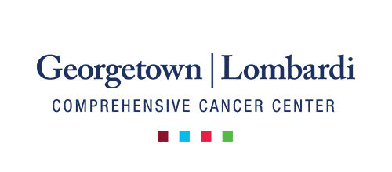

---

  My first exposure to public health and epidemiology research was working as a summer Research Assistant at the Georgetown University Lombardi Cancer Comprehensive Center. As a Research Assistant, I assisted a population sciences researcher, Dr. Judy Huei-yu Wang, with a five-year randomized control trial (RCT) to test the effect of cultural targeting on increasing mammography screening specifically in Chinese immigrants. The projects I worked on examined biological and cultural impacts on cancer prevention and care, and health disparities. Additionally, I started a fundraising project in collaboration with CANCER101 to create a toolkit guiding newly-diagnosed breast cancer patients through treatments and care, translated ~20 phone interviews with breast cancer survivors from Chinese to English, made two informational pamphlets for breast cancer patients, and worked on breast cancer research data analysis. During my Master of Public Health in Epidemiology program, I worked with Dr. Jeanine Genkinger on a new research study of nutrition, early detection, and cancer risk and survival (primarily focused on ovarian and pancreatic cancers) for 34 international cohort studies included in the Pooling Project of Prospective Studies of Diet and Cancer (DCPP) of Harvard University. My routine tasks included assisting with NIH research grant submissions, performing word processing for scientific manuscripts, conducting data analysis and literature searches, updating research databases, preparing PowerPoint presentations, and creating tables, graphs, and spreadsheets. As a Graduate Research Assistant, I co-authored an epidemiology methods manuscript on the data standardization process for comparison across five different dietary indices and a systematic review on risk factors for double primary breast and ovarian cancer in women across the risk spectrum.