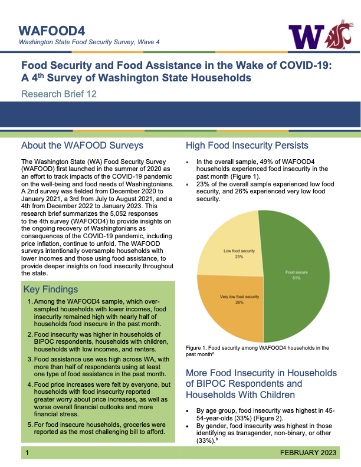

---
author:
categories:
date: "2023-07-07"
draft: false
excerpt: Research on food security and food assistance in Washington State
featured: true
layout: single
links:
- icon: newspaper
  icon_pack: fas
  name: "Association between health care access and food insecurity among lower-income older adults with multiple chronic conditions in Washington State, USA"
  url: https://doi.org/10.1017/S1368980022001240
- icon: door-open
  icon_pack: fas
  name: "WAFOOD Brief 12 – Food Security and Food Assistance in the Wake of COVID-19: A 4th Survey of Washington State Households"
  url: https://nutr.uw.edu/cphn/wafood/brief-12
- icon: door-open
  icon_pack: fas
  name: "WAFOOD Brief 13 – Food Access and Economic Well-being: Additional findings from a 4th survey of Washington State households"
  url: https://nutr.uw.edu/cphn/wafood/brief-13
- icon: door-open
  icon_pack: fas
  name: "WAFOOD Brief 14 – Washington State Food Security Surveys: Cross-sectional findings from survey waves 1-4, 2020-2023"
  url: https://nutr.uw.edu/cphn/wafood/brief-14
- icon: door-open
  icon_pack: fas
  name: "WAFOOD Brief 15 – Washington State Food Security Surveys: Longitudinal findings across survey waves 1-4, 2020-2023"
  url: https://nutr.uw.edu/cphn/wafood/brief-15
subtitle: "Research on food security and food assistance in Washington State"
tags:
title: Food Security
---

---

Increasing community access to basic needs (such as food and health care) is what inspired me to embark on a career in public health. From the research side, I have analyzed data specific to Washington State to 1) examine the association between health care access and food insecurity among lower-income older adults and 2) monitor the economic impact of COVID-19 and related inflationary food price fluctuations on Washington State residents’ food security and needs. In addition to my past research work, I also have more than a decade of experience volunteering for various hunger relief programs (the Salvation Army of Baltimore, Cathedral Church of Saint John the Divine and Xavier Mission of New York City, and Ballard Food Bank of Seattle).