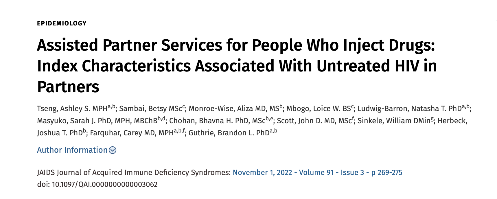

---

In the first year of my PhD, I worked as a Research Assistant to Drs. Carey Farquhar and Joshua Herbeck on a study that utilizes assisted partner services to increase testing and linkage to care among people who inject drugs (PWID) in Kenya and additionally uses viral phylogenetics to understand HIV and Hepatitis C virus transmission in the population (NIH R01DA043409). I first-authored a manuscript examining index participant characteristics, and co-authored manuscripts on viral suppression and HIV and SARS-CoV-2 phylogenetics within the PWID population (both in-progress). The research I conducted in this study helped me recognize the importance of linkage to and engagement in care for persons living with HIV. To further explore my research interest in linkage to HIV care, I worked on a HIV-Tuberculosis (TB) Modeling Study in September 2021-June 2022 with Dr. Jennifer Ross (NIH K01AI138620), utilizing data from clinical literature about uptake and effectiveness of HIV prevention services to estimate the health impact of linking serodiscordant couples in TB-affected households to ART for the positive partner and HIV prevention services for the negative partner. My PhD Dissertation research is focused on comparing the home delivery of antiretroviral therapy to clinic-based refills for people living with HIV in rural South Africa.