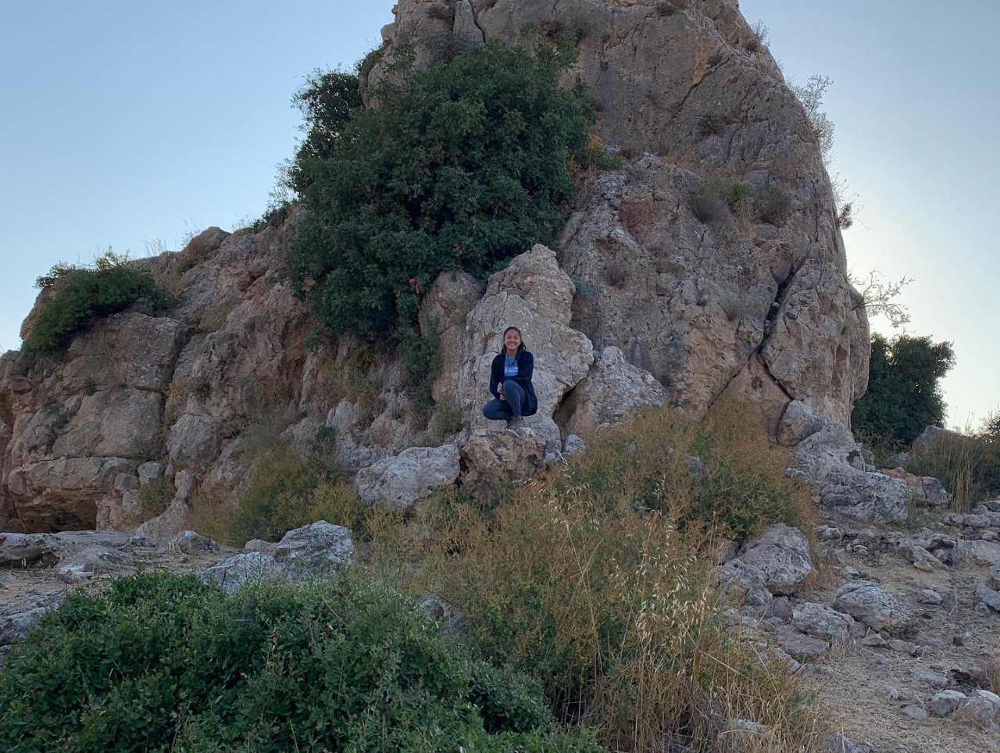

---
author:
categories:
date: "2022-07-01"
draft: false
excerpt: Research at the nexus of human, animal, and environmental health
featured: true
layout: single
links:
- icon: door-open
  icon_pack: fas
  name: Data Visualization Example - Livestock Trade & Potential Zoonotic Disease Risk
  url: https://ashleytseng.shinyapps.io/csss569_assignment3/
- icon: github
  icon_pack: fab
  name: Bioinformatic Analysis - Resistance Genes
  url: https://github.com/atseng1/hmrg
subtitle: "Research at the nexus of human, animal, and environmental health"
tags:
title: One Health
---

---

Utilizing a One Health approach, I have used various epidemiological, biostatistics, and bioinformatics applications to study infectious diseases. After undergrad, I was an Epidemiology Student Trainee at the U.S. Department of the Interior, National Park Service (NPS). At the NPS, I worked on developing content (e.g., infectious disease fact sheets) for the NPS internal and external websites, evaluating the Appalachian Trail’s current norovirus surveillance system to identify strengths and gaps, using CDC software EpiInfo to develop and deploy a disease detection survey for norovirus cases in Yellowstone National Park, and performing fieldwork (tick dragging) for a multi-year CDC Lyme disease surveillance project in Rock Creek Park, Maryland. For my Master of Public Health (MPH) in Epidemiology practicum, I interned at EcoHealth Alliance with the Western Asia Bat Research Network Project (WAB-Net), during which I collected diagnostic samples from wild-caught bats for coronavirus surveillance in Turkey and Jordan and conducted a network analysis on livestock trade and prevalence of three zoonotic diseases between 20 Western Asia countries in R. After the practicum concluded, I transitioned the network analysis to become my MPH in Epidemiology Thesis, which was submitted upon my graduation in May 2020. Most recently, as a U.S. National Institutes of Health-National Institute of Environmental Health Sciences Predoctoral Fellow (NIH T32ES015459) from 2020-2022, I worked with Drs. Peter Rabinowitz, Marilyn Roberts, and Scott Weissman at the University of Washington on characterizing the diversity of sequence types through phylogenetics and the co-occurrence of heavy metal resistance genes and antibiotic resistance genes of public health relevance through bioinformatics in *Escherichia coli* isolates from marine mammal and water sources in the Salish Sea ecosystem.
